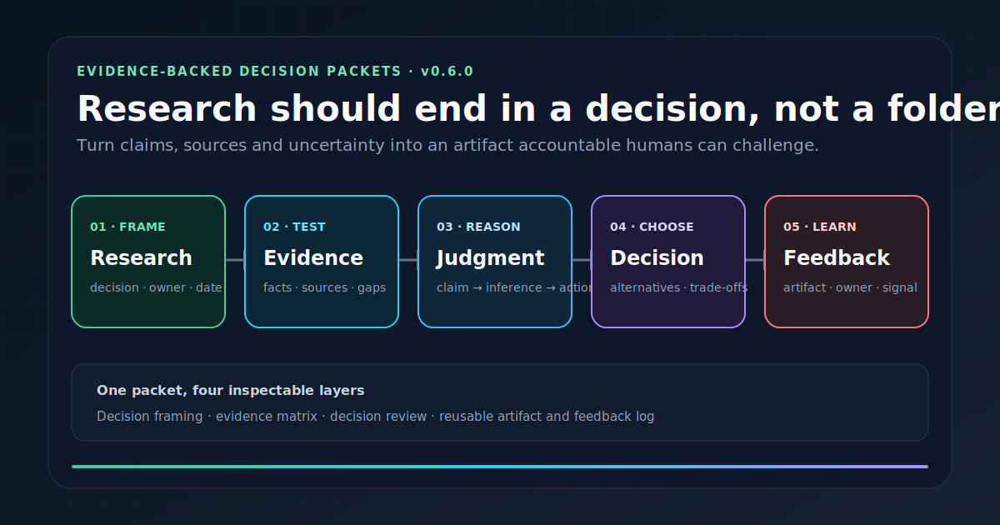

# Research-to-Decision Toolkit


<p align="center">
  
</p>

## Try it in 60 seconds

```bash
python -m pip install "https://github.com/Anonymousyz/research-to-decision-toolkit/releases/download/v0.6.0/research_to_decision_toolkit-0.6.0-py3-none-any.whl"
r2d init brief.json
r2d validate brief.json
r2d report brief.json --output decision_report.md
```

The starter brief is a valid fictional example. Replace it with permission-cleared sources, alternatives, decision ownership and feedback criteria, then rerun validation. See the [fictional end-to-end case](examples/fictional-ai-governance-research-to-decision/README.md) or submit a [field-test report](https://github.com/Anonymousyz/research-to-decision-toolkit/issues/new?template=field-test.yml).

> **Open research → evidence → human decision → reusable artifact → feedback.**

A local-first toolkit for turning research, policy analysis, product discovery, and AI-deployment evidence into a decision packet that accountable people can review, challenge, and reuse.

The repository addresses a common failure mode in advisory and applied-AI work: evidence is collected, slides are written, and yet nobody can identify the actual decision, the alternatives, the owner, the default outcome, the conditions that would change the conclusion, or the artifact that remains after the meeting. R2D gives those elements a shared structure.

> [!IMPORTANT]
> The fixed 24-point score is an author-designed, uncalibrated structural-workflow heuristic. “Structurally ready for human decision meeting” does not mean approved, correct, compliant, or ready to implement. Human source-check fields are declarations; the CLI does not fetch or authenticate sources. See [`docs/method_status.md`](docs/method_status.md).

```text
problem → evidence → judgment → alternatives and controls → human decision → reusable artifact → feedback
```

It is useful for researchers, policy analysts, consultants, product owners, independent builders, forward-deployed engineers, and governance practitioners who need analysis to survive outside the original conversation.

## What the toolkit structures

| Decision-packet layer | Required question | Public artifact |
|---|---|---|
| Decision framing | What decision is being made, by whom, by when, and what happens by default? | problem-framing canvas, decision memo |
| Evidence | Which claims are facts, judgments, assumptions, or recommendations? What is weakest? | evidence matrix, source declaration, uncertainty list |
| Decision review | What are the alternatives, criteria, stakeholders, reversibility, trade-offs, and credible failure modes? | decision-review module, pre-mortem, red-team prompt |
| Artifact and feedback | What will survive the meeting, who owns it, and what feedback can change the next move? | artifact brief, acceptance criteria, feedback log |

The toolkit is deliberately narrower than a project-management system and broader than a note-taking template. It does not replace domain expertise, legal review, security review, or accountable judgment. It makes the structure of those conversations inspectable.

---

## When research needs to become a decision

Use it when the problem sounds like this:

> I did a lot of research but I am not sure what decision it supports, what artifact it should become, or whether anyone else even cares.

The workflow helps you:

1. Frame the real decision before collecting more evidence.
2. Organize what you know into an evidence matrix.
3. Separate facts from assumptions from judgments.
4. Decide whether the result should be a memo, a template, a tool, or a publication.
5. Publish only permission-cleared artifacts and log the feedback signals that come back.

---

## Repository map

| Area | Files | Purpose |
|---|---|---|
| Philosophy | [`MANIFESTO.md`](MANIFESTO.md) | Why research needs an artifact, and artifacts need feedback |
| Frame the decision | [`templates/problem-framing-canvas.md`](templates/problem-framing-canvas.md) | Turn a vague topic into a real decision question |
| Organize evidence | [`templates/evidence-matrix.md`](templates/evidence-matrix.md) | Sort claims into facts, judgments, assumptions, gaps |
| Decide the move | [`templates/decision-memo.md`](templates/decision-memo.md) | A short memo that produces a real decision |
| Decide the artifact | [`templates/public-artifact-brief.md`](templates/public-artifact-brief.md) | Decide whether the result becomes a repo, an article, a tool, or a workshop |
| Capture feedback | [`templates/feedback-log.md`](templates/feedback-log.md) | Record public feedback signals without overfitting |
| Score the structure | [`scorecards/decision-readiness-scorecard.md`](scorecards/decision-readiness-scorecard.md) | Four transparent six-point areas for human decision-meeting workflow completeness |
| Red-team the commitment | [`modules/decision-review/`](modules/decision-review/) | Alternatives, fragile assumptions, pre-mortem, red-team prompt, and human-review scorecard |
| Review the reasoning chain | [`modules/argument-quality/`](modules/argument-quality/) | Concept, evidence, and action gates plus claim→evidence→inference→action chains |
| Review the written artifact | [`modules/judgment-writing/`](modules/judgment-writing/) | Path A/B and an ordered five-pass judgment-writing record |
| AI prompts | [`prompts/research-synthesis-prompt.md`](prompts/research-synthesis-prompt.md), [`prompts/critical-review-prompt.md`](prompts/critical-review-prompt.md), [`prompts/public-artifact-transform-prompt.md`](prompts/public-artifact-transform-prompt.md) | Use AI to draft, stress-test, and transform |
| Example | [`examples/fictional-ai-governance-research-to-decision/`](examples/fictional-ai-governance-research-to-decision/) | A fictional end-to-end case |
| CLI | [`src/r2d`](src/r2d), [`docs/cli.md`](docs/cli.md) | Initialize, validate, score, and report a decision brief locally |
| Tests | [`tests/test_r2d.py`](tests/test_r2d.py) | Schema, score invariants, veto, reporting, and CLI behavior |
| CI template | [`docs/github_actions_validate.template.yml`](docs/github_actions_validate.template.yml) | Copy-ready validation workflow; intentionally inactive until a token with `workflow` scope is available |
| Method boundary | [`docs/method_status.md`](docs/method_status.md) | Explain what the score can and cannot establish |
| AI deployment context | [`docs/using_r2d_after_ai_prototype_review.md`](docs/using_r2d_after_ai_prototype_review.md) | Show how a prototype-readiness assessment becomes a separate human decision packet |
| Quickstart | [`docs/quickstart.md`](docs/quickstart.md) | 10 minutes to first decision brief |
| Sources | [`SOURCES.md`](SOURCES.md) | Where the method comes from |
| Roadmap | [`docs/roadmap.md`](docs/roadmap.md) | What this repo will become next |

---

## Quick start

### Option A: manual

1. Open [`templates/problem-framing-canvas.md`](templates/problem-framing-canvas.md) and write down the real decision question.
2. Move claims into [`templates/evidence-matrix.md`](templates/evidence-matrix.md).
3. Use [`templates/decision-memo.md`](templates/decision-memo.md) to produce a memo.
4. Use [`templates/public-artifact-brief.md`](templates/public-artifact-brief.md) to choose the artifact form.
5. Use the [`argument-quality`](modules/argument-quality/) gate to expose the inference, boundary, and counterevidence behind the proposed action.
6. Run the [`judgment-writing`](modules/judgment-writing/) five-pass review; return to research instead of polishing an unsupported conclusion.
7. Use [`scorecards/decision-readiness-scorecard.md`](scorecards/decision-readiness-scorecard.md) to decide whether the brief is ready for a decision meeting.
8. After shipping, log feedback in [`templates/feedback-log.md`](templates/feedback-log.md).

### Option B: CLI

```bash
python -m venv .venv
. .venv/bin/activate  # Windows: .venv\Scripts\activate
python -m pip install -e .
r2d init     my_decision_brief.json
r2d validate examples/fictional-ai-governance-research-to-decision/decision_brief.json
r2d score   examples/fictional-ai-governance-research-to-decision/decision_brief.json
r2d report  examples/fictional-ai-governance-research-to-decision/decision_brief.json --output decision_report.md
```

Expected output:

```text
Decision: Structurally ready for human decision meeting
Total: 23/24
Normalized: 95.8%
Veto: no
Top gaps:
- feedback log is not yet filled
```

See [`docs/cli.md`](docs/cli.md).

---

## How to read this repository

If you only have 5 minutes:

1. Read this README.
2. Read [`MANIFESTO.md`](MANIFESTO.md).
3. Skim [`examples/fictional-ai-governance-research-to-decision/`](examples/fictional-ai-governance-research-to-decision/).

If you have 30 minutes:

1. Read the manifesto, the quickstart, and the road map.
2. Walk through one template end to end with your own material.

If you have 2 hours:

1. Reproduce the fictional example from scratch.
2. Adapt each template to your own domain.
3. Try the CLI.

---

## Out of scope and method boundary

- not a substitute for legal, security, compliance, or medical advice;
- not a guarantee of correctness for any specific decision;
- not a project management or task tracking tool;
- not a content calendar.

It is a structured starting point for moving research from private thoughts to reviewable evidence, an accountable decision meeting, a reusable artifact, and feedback. AI-generated challenges are draft material. They are not source evidence or independent review.

---

## License

MIT. See [`LICENSE`](LICENSE).
