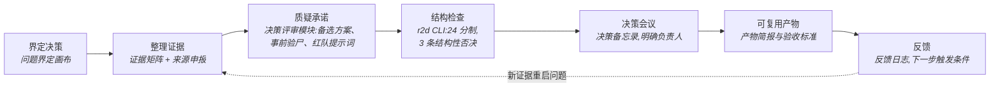
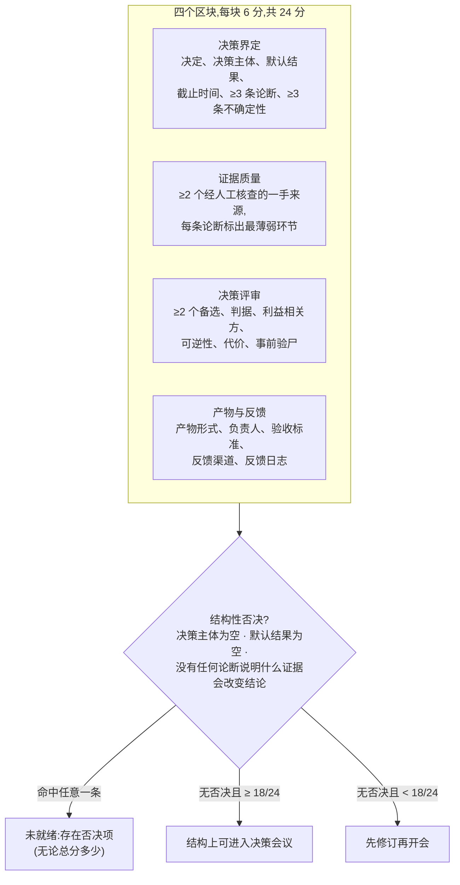

# Research-to-Decision Toolkit(研究→决策工具包)


[](https://github.com/Anonymousyz/research-to-decision-toolkit/actions/workflows/validate.yml)

[English README](README.md)

一个本地优先的工具包,把研究、政策分析、产品调研和 AI 部署证据整理成**决策包**:让负责决策的人能够审阅、质疑、复用,而不是在会后只剩一份没人记得结论的幻灯片。

它针对咨询与应用 AI 工作里的一类常见失败:证据收集了,报告写了,但没有人说得清**到底要做什么决定、备选方案是什么、谁拍板、不决策会发生什么、什么证据会改变结论、会后留下哪份可复用的产物**。R2D 给这些要素一个固定结构。

> [!IMPORTANT]
> 固定的 24 分是作者自行设计、**未经校准**的结构完整度启发式。"结构上可进入决策会议"不等于方案正确、合规或可以执行。来源核查字段是人工申报;CLI 不抓取也不验证 URL 内容。方法边界见 [`docs/method_status.md`](docs/method_status.md)。

## 60 秒试用

```bash
python -m pip install "https://github.com/Anonymousyz/research-to-decision-toolkit/releases/download/v0.6.0/research_to_decision_toolkit-0.6.0-py3-none-any.whl"
r2d init brief.json
r2d validate brief.json
r2d report brief.json --output decision_report.md
```

起步 brief 是一个可通过校验的虚构示例。把它替换为授权来源、备选方案、决策归属与反馈标准后,重新跑校验即可。

## 工作流

```text
问题 → 证据 → 判断 → 备选与控制 → 人的决策 → 可复用产物 → 反馈
```

每一步都有对应的模板、模块或 CLI 检查:



## 工具包结构化的四层内容

| 决策包层次 | 必须回答的问题 | 对应公开产物 |
|---|---|---|
| 决策界定 | 在决定什么?由谁、何时决定?不决定的默认结果是什么? | 问题界定画布、决策备忘录 |
| 证据 | 哪些说法是事实、判断、假设、建议?最薄弱的环节在哪? | 证据矩阵、来源申报、不确定性清单 |
| 决策评审 | 备选方案、判据、利益相关方、可逆性、代价、可信的失败方式是什么? | 决策评审模块、事前验尸、红队提示词 |
| 产物与反馈 | 会后留下什么?谁负责?什么反馈会改变下一步? | 产物简报、验收标准、反馈日志 |

它比项目管理系统窄,比笔记模板宽。它不替代领域专业知识、法律审查、安全审查或负责人的判断;它让这些对话的**结构**变得可检查。

## 什么时候用

当问题听起来是这样时:

> 研究做了很多,但我说不清它支持什么决定、该变成什么产物、有没有人在乎。

工作流帮你:

1. 在继续收集证据之前,先界定真正要做的决定;
2. 把已知内容整理进证据矩阵;
3. 把事实、假设、判断分开;
4. 决定产出形式:备忘录、模板、工具还是文章;
5. 只发布授权范围内的产物,并记录回流的反馈信号。

## 快速开始

### 方式 A:纯手工

1. 用[问题界定画布](templates/problem-framing-canvas.md)写下真正的决策问题;
2. 把论断整理进[证据矩阵](templates/evidence-matrix.md);
3. 用[决策备忘录](templates/decision-memo.md)形成决定;
4. 用[产物简报](templates/public-artifact-brief.md)确定产出形式;
5. 用[论证质量门](modules/argument-quality/)暴露推理、边界与反证;
6. 跑一遍[判断写作五遍审查](modules/judgment-writing/);结论撑不住就回去补研究,不要润色;
7. 用[决策就绪计分卡](scorecards/decision-readiness-scorecard.md)判断是否可以进入决策会议;
8. 发布后,把反馈记进[反馈日志](templates/feedback-log.md)。

### 方式 B:CLI

```bash
python -m venv .venv
. .venv/bin/activate  # Windows: .venv\Scripts\activate
python -m pip install -e .
r2d init     my_decision_brief.json
r2d validate examples/fictional-ai-governance-research-to-decision/decision_brief.json
r2d score   examples/fictional-ai-governance-research-to-decision/decision_brief.json
r2d report  examples/fictional-ai-governance-research-to-decision/decision_brief.json --output decision_report.md
```

预期输出:

```text
Decision: Structurally ready for human decision meeting
Total: 23/24
Normalized: 95.8%
Veto: no
Top gaps:
- feedback log is not yet filled
```

命令、退出码与 v0.6 扩展见 [`docs/cli.md`](docs/cli.md)。

## 24 分到底在测什么

CLI 检查四个区块的结构完整度,每块 6 分;三条结构性否决在任何得分下都会拦下"就绪"判定;18/24 是就绪阈值:



"结构上可进入决策会议"只说明流程要素齐了,可以摆到负责人面前;它不评价这个决定本身是否正确。

## 仓库地图

| 用途 | 位置 |
|---|---|
| 方法立场 | [`MANIFESTO.md`](MANIFESTO.md) |
| 四层模板 | [`templates/`](templates/):问题界定、证据矩阵、决策备忘录、产物简报、反馈日志 |
| 决策评审模块 | [`modules/decision-review/`](modules/decision-review/):备选方案、脆弱假设、事前验尸、红队提示词 |
| 论证质量模块 | [`modules/argument-quality/`](modules/argument-quality/):概念/证据/行动三道门 + 论证链 |
| 判断写作模块 | [`modules/judgment-writing/`](modules/judgment-writing/):A/B 路径 + 五遍审查 |
| CLI 源码 | [`src/r2d`](src/r2d),文档见 [`docs/cli.md`](docs/cli.md) |
| 虚构端到端案例 | [`examples/fictional-ai-governance-research-to-decision/`](examples/fictional-ai-governance-research-to-decision/) |
| 测试 | [`tests/`](tests/):schema、评分不变量、否决、报告与文档边界 |
| 持续集成 | [`.github/workflows/validate.yml`](.github/workflows/validate.yml)(Python 3.9/3.11/3.12) |
| 方法边界 | [`docs/method_status.md`](docs/method_status.md) |
| 与 AI 就绪度评估的衔接 | [`docs/using_r2d_after_ai_prototype_review.md`](docs/using_r2d_after_ai_prototype_review.md) |
| 路线图 | [`docs/roadmap.md`](docs/roadmap.md) |

## 边界

- 不替代法律、安全、合规或医疗建议;
- 不保证任何具体决定的正确性;
- 不是项目管理或任务跟踪工具;
- AI 生成的质疑只是草稿素材,不是证据来源,也不是独立评审。

## 许可证

MIT,见 [`LICENSE`](LICENSE)。
