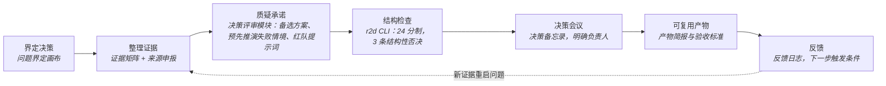
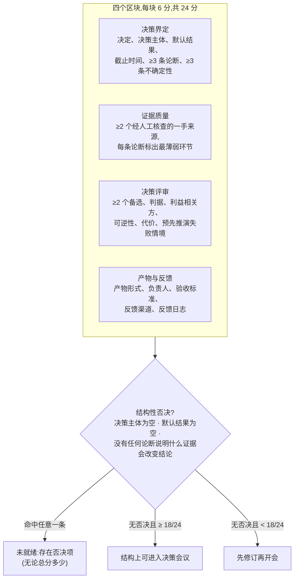

# Research-to-Decision Toolkit（研究到决策工具包）


[](https://github.com/Anonymousyz/research-to-decision-toolkit/actions/workflows/validate.yml)

[English README](README.md)

项目状态、适用边界和反馈方式见 [STATUS.md](STATUS.md)。

这是一个本地优先的工具包，用于把研究、政策分析、产品调研和 AI 部署材料整理成决策包。负责人可以据此核对证据、比较方案、提出质疑，并留下会后仍能使用的记录。

研究材料已经不少时，仍常常答不上这些问题：要做什么决定、有哪些备选、由谁决定、不决定会怎样、什么证据会改变结论，以及会后留下什么。R2D 为这些要素提供固定结构。

> [!IMPORTANT]
> 固定的 24 分是作者设计、未经校准的结构完整度启发式。“结构上可进入决策会议”不等于方案正确、合规或可以执行。来源核查字段由人工填写；CLI 不抓取或验证 URL 内容。方法边界见 [`docs/method_status.md`](docs/method_status.md)。

## 生成一份示例决策包

```bash
python -m pip install "https://github.com/Anonymousyz/research-to-decision-toolkit/releases/download/v0.6.0/research_to_decision_toolkit-0.6.0-py3-none-any.whl"
r2d init brief.json
r2d validate brief.json
r2d report brief.json --output decision_report.md
```

起步 brief 是可通过校验的虚构示例。把它替换为已获授权的来源、备选方案、决策归属和反馈标准后，再运行校验。

## 工作流

```text
问题 → 证据 → 判断 → 备选与控制 → 人的决策 → 可复用产物 → 反馈
```

每一步都有对应的模板、模块或 CLI 检查：


```mermaid
flowchart LR
    A["界定决策<br/><i>问题界定画布</i>"] --> B["整理证据<br/><i>证据矩阵 + 来源申报</i>"]
    B --> C["质疑承诺<br/><i>决策评审模块：备选方案、<br/>预先推演失败情境、红队提示词</i>"]
    C --> D["结构检查<br/><i>r2d CLI：24 分制，<br/>3 条结构性否决</i>"]
    D --> E["决策会议<br/><i>决策备忘录，明确负责人</i>"]
    E --> F["可复用产物<br/><i>产物简报与验收标准</i>"]
    F --> G["反馈<br/><i>反馈日志，下一步触发条件</i>"]
    G -. "新证据重启问题" .-> B
```

## 工具包整理的四层内容

| 决策包层次 | 必须回答的问题 | 对应公开产物 |
|---|---|---|
| 决策界定 | 在决定什么？由谁、何时决定？不决定的默认结果是什么？ | 问题界定画布、决策备忘录 |
| 证据 | 哪些说法是事实、判断、假设或建议？最薄弱的环节在哪？ | 证据矩阵、来源申报、不确定性清单 |
| 决策评审 | 备选方案、判据、利益相关方、可逆性、代价和可信的失败方式是什么？ | 决策评审模块、预先推演失败情境、红队提示词 |
| 产物与反馈 | 会后留下什么？谁负责？什么反馈会改变下一步？ | 产物简报、验收标准、反馈日志 |

R2D 不承担项目管理。它把证据、判断、备选方案和会后行动放进同一份可审议的材料；领域知识、法律审查、安全审查和负责人的判断仍需由相应责任主体承担。

## 适用情形

当你已经做了不少研究，却说不清它支持什么决定、应当形成什么产物，或由谁使用时，可以用这套工作流：

1. 在继续收集证据之前，先界定真正要做的决定；
2. 把已有材料整理进证据矩阵；
3. 区分事实、假设和判断；
4. 选择产出形式：备忘录、模板、工具或文章；
5. 只发布授权范围内的内容，并记录会改变下一步的反馈。

## 快速开始

### 方式 A：纯手工

1. 用[问题界定画布](templates/problem-framing-canvas.md)写下真正的决策问题。
2. 把论断整理进[证据矩阵](templates/evidence-matrix.md)。
3. 用[决策备忘录](templates/decision-memo.md)形成决定。
4. 用[产物简报](templates/public-artifact-brief.md)确定产出形式。
5. 用[论证质量门](modules/argument-quality/)检查推理、边界与反证。
6. 跑一遍[判断写作五遍审查](modules/judgment-writing/)。结论撑不住，就回去补研究，不要只润色。
7. 用[决策就绪计分卡](scorecards/decision-readiness-scorecard.md)判断是否可以进入决策会议。
8. 发布后，把反馈记进[反馈日志](templates/feedback-log.md)。

### 方式 B：CLI

```bash
python -m venv .venv
. .venv/bin/activate  # Windows: .venv\Scripts\activate
python -m pip install -e .
r2d init     my_decision_brief.json
r2d validate examples/fictional-ai-governance-research-to-decision/decision_brief.json
r2d score   examples/fictional-ai-governance-research-to-decision/decision_brief.json
r2d report  examples/fictional-ai-governance-research-to-decision/decision_brief.json --output decision_report.md
```

预期输出：

```text
Decision: Structurally ready for human decision meeting
Total: 23/24
Normalized: 95.8%
Veto: no
Top gaps:
- feedback log is not yet filled
```

命令、退出码与 v0.6 扩展见 [`docs/cli.md`](docs/cli.md)。

## 24 分到底在测什么

CLI 检查四个区块的结构完整度，每块 6 分。三条结构性否决在任何得分下都会阻止“就绪”判定；18/24 是结构检查的阈值：


```mermaid
flowchart TB
    subgraph areas["四个区块,每块 6 分,共 24 分"]
        A1["决策界定<br/>决定、决策主体、默认结果、<br/>截止时间、≥3 条论断、≥3 条不确定性"]
        A2["证据质量<br/>≥2 个经人工核查的一手来源,<br/>每条论断标出最薄弱环节"]
        A3["决策评审<br/>≥2 个备选、判据、利益相关方、<br/>可逆性、代价、预先推演失败情境"]
        A4["产物与反馈<br/>产物形式、负责人、验收标准、<br/>反馈渠道、反馈日志"]
    end
    areas --> S{"结构性否决?<br/>决策主体为空 · 默认结果为空 ·<br/>没有任何论断说明什么证据会改变结论"}
    S -- "命中任意一条" --> V["未就绪:存在否决项<br/>(无论总分多少)"]
    S -- "无否决且 ≥ 18/24" --> R["结构上可进入决策会议"]
    S -- "无否决且 < 18/24" --> W["先修订再开会"]
```

“结构上可进入决策会议”只说明必要的流程要素已经列出，可以交给负责人审阅；它不评价决定本身是否正确。

## 仓库地图

| 用途 | 位置 |
|---|---|
| 方法立场 | [`MANIFESTO.md`](MANIFESTO.md) |
| 四层模板 | [`templates/`](templates/):问题界定、证据矩阵、决策备忘录、产物简报、反馈日志 |
| 决策评审模块 | [`modules/decision-review/`](modules/decision-review/):备选方案、脆弱假设、预先推演失败情境、红队提示词 |
| 论证质量模块 | [`modules/argument-quality/`](modules/argument-quality/):概念/证据/行动三道门 + 论证链 |
| 判断写作模块 | [`modules/judgment-writing/`](modules/judgment-writing/):A/B 路径 + 五遍审查 |
| CLI 源码 | [`src/r2d`](src/r2d),文档见 [`docs/cli.md`](docs/cli.md) |
| 虚构端到端案例 | [`examples/fictional-ai-governance-research-to-decision/`](examples/fictional-ai-governance-research-to-decision/) |
| 测试 | [`tests/`](tests/):schema、评分不变量、否决、报告与文档边界 |
| 持续集成 | [`.github/workflows/validate.yml`](.github/workflows/validate.yml)(Python 3.9/3.11/3.12) |
| 方法边界 | [`docs/method_status.md`](docs/method_status.md) |
| 与 AI 就绪度评估的衔接 | [`docs/using_r2d_after_ai_prototype_review.md`](docs/using_r2d_after_ai_prototype_review.md) |
| 路线图 | [`docs/roadmap.md`](docs/roadmap.md) |

## 边界

- 不提供法律、安全、合规或医疗意见；
- 不保证任何具体决定正确；
- 不承担项目管理或任务跟踪功能；
- AI 生成的质疑只能作为草稿素材，不能充当证据来源或独立评审。

## 许可证

MIT，见 [`LICENSE`](LICENSE)。
